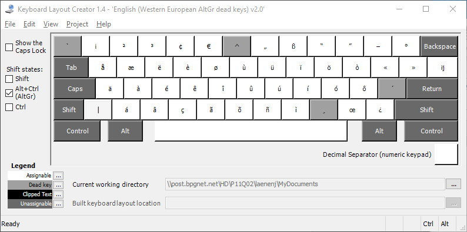
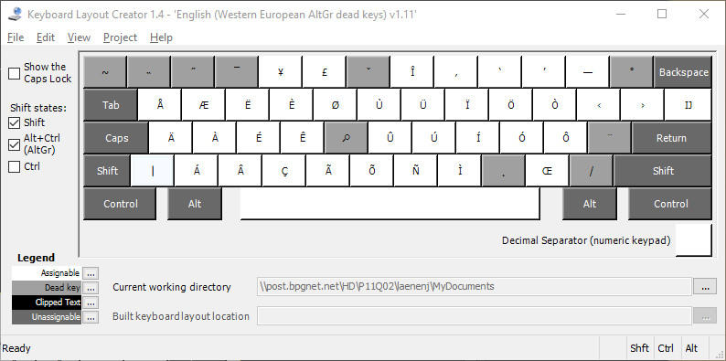

A western european keyboard layout for Windows, with AltGr dead keys and precomposed diacritics, inspired by https://choam.eu/altgr-intl and https://github.com/thomasfaingnaert/win-us-intl-altgr, made by means of https://github.com/39aldo39/klfc after importing https://choam.eu/altgr-intl into my /usr/share/X11/xkb/symbols/us.  As klfc didn't do OEM_102 I added the missing line starting with 56 OEM_102.

I had to change the name of this keyboard into an 8 character string altgrweu and changed the filename from us-altgr-weur.klc to altgr-weur.klc.  unix2dos was used as well as the Microsoft Keyboard Layout Creator cannot handle files with lf's only.

Some dead keys like dead_greek don't work.

This is version v1.13 by Adriaan.

