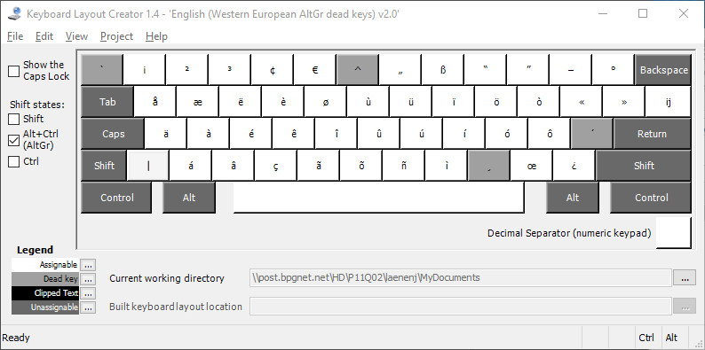
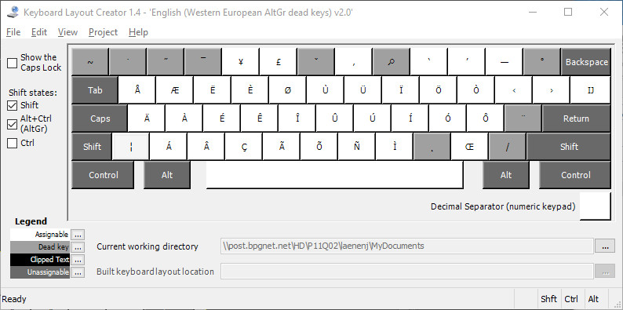

# English (Western European AltGr dead keys)

This is [AltGr-WEur](https://altgr-weur.eu) for Windows, a western european keyboard layout, with AltGr dead keys
and precomposed diacritics.

This fork is an updated and improved version of the official version from [Johan Laenen](https://github.com/gargle/altgr-weur).
It fixes a wrong Unicode code point resulting in wrong inputs by using the same Unicode code point like [XKB](https://www.x.org/wiki/XKB) does.
Additionally, the dead key sequences have been improved to follow the MSKLC recommendations and some metadata has been added.

## Usage

Install the keyboard layout and add the keyboard `English (Western European AltGr dead keys)` to your current locale.

## Binary Installation

This is the easiest way, use the latest installer from the [Releases](https://github.com/sodevel/altgr-weur/releases) page.

**NOTICE:** The keyboard layout is connected to the German system locale `Deutsch`, if this locale is not present
            on your system, it will get added as well and show up in the language toolbar. If this is not desired,
            you have to compile an own installer from source and connect it to the desired system locale.

## Source Compilation

To compile the keyboard layout source file, you have to install the [Microsoft Keyboard Layout Creator (MSKLC) Version 1.4](https://www.microsoft.com/en-us/download/details.aspx?id=102134).
The keyboard layout source file does not contain a locale definition, hence MSKLC will use the current system locale for the created installer.
Ensure that your system is currently using the desired locale and start MSKLC. Use `File | Load Source File...` and select `altgr-weur.klc`.
Create the installer by using `Project | Build DLL and Setup Package`, install the keyboard layout by starting the created `setup.exe`.
